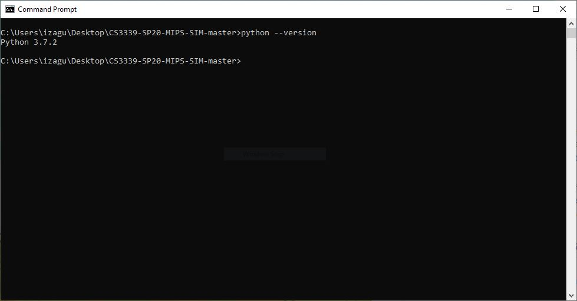
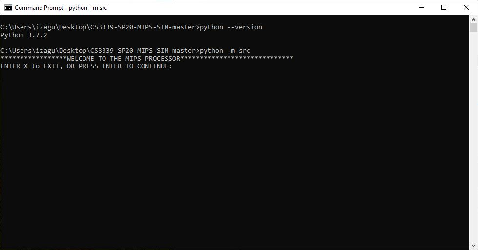
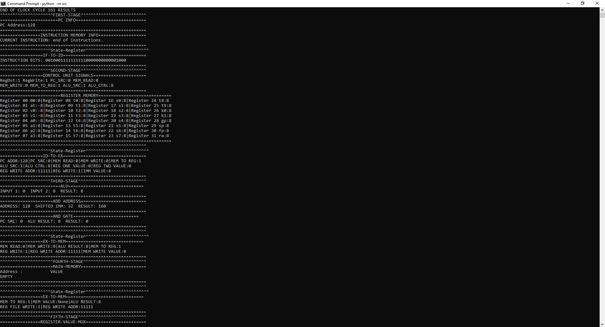

# CS3339-SP20
# MIPS Simulator
> A 5-stage MIPS Simulator

## Table of contents
* [Description](#Description)
* [How to Run The Simulator](#How-to-Run-The-Simulator)
* [Specifications for Input](#Specifications-for-Input)
* [Running the Program](#Running-the-Program)
* [The 5 Stages](#The-5-Stages)
* [Important Notes So Far](#Important-Notes-So-Far)
* [Sample Screenshot](#Sample-Screenshot)

## Description
This is a MIPS Simulator that takes a file and reads mips instructions from it. There are 4 modes that the program can run. Mode 1 runs through the entire assembly program instructions and displays the end state of the memory and registers, it works by running each instruction through the 5 stages one by one, this means data and control hazards will not affect it. Mode 0 runs it in a similar way but it displays the state of the registers and memory after each instruction is run through the 5 stages. Mode 22 also displays the end state after running the instructions through the 5 stages but the difference in this Mode is, that all the instructions are pipelined. Mode 11 is also pipelined but instead of displaying the end state of program it displays the state of each stage component,ie memory,alu,registers,etc, after each cycle is completed.

## How to Run The Simulator
### Step 1: Install Latest Python, 3 or above works, 2.0 does not work.
#### this [link](https://www.python.org/) is for the python website , you can also use a package manager like homebrew or others to install python 3.
### Step 2: Make sure Python 3 is installed, preferably the lastest version, use python --version to check.

### Step 3: Download zip file from Repository and unzip somewhere in your computer, make sure you can cd to this repository folder.
#### The download from this Repository will be a CS3339-SP20-MIPS-SIM-master zip file, unzip it.
### Step 4: Open command console and cd(change directory) to the CS3339-SP20-MIPS-SIM-master folder, make sure you are in it, ls to see all the contents from the folder.
### Step 5: From inside this folder, CS3339-SP20-MIPS-SIM-master, in command line run command <python -m src>

### Step 4: The Program should start with a WELCOME TO MIPS SIMULATOR.

## Specifications for Input
### What Files Can The Program Run:
#### This Program can work on any plain text files, the inside must be encoded for reading characters, no binary encoding. .asm files are prefered. The asm files in this Repository are example that run.
### File Structure:
### What is ignored and not implemented:
#### A typical MIPS assembly file has a .data section, i could not implement actions for dealing with directives so .text, .data are ignored. Labels were also not implemented so main:,and others are simply ignored. Comments are also ignored, comments are defined by starting with a # symbol. Basically have a sequence of instructions with nothing else.
### What is not ignored:
#### THe following Assembly Instructions are implemented.
##### R-Type
* add $d, $s, $t
* sub $d, $s, $t 
* sll $d, $t, h 
* srl $d, $t, h
* and $d, $s, $t	
* or  $d, $s, $t
* mul $d, $s, $t
* nop
##### I-Type
* beq $s, $t, offset
* addi $t, $s, imm
* sw $t, offset($s)
* lw $t, offset($s)
##### J-Type
j offset

## Running the Program
* First the program welcomes you, and asks you to press enter to continue or x to exit.
* Second it ask the user to enter an asm file at this point you can enter the full path of the file, or the relative path of the file to src, if the user places the files they want to test on the same folder,CS3339-SP20-MIPS-SIM-master, as src it should work with typing the file name.
* Third after entering the file name it asks you to enter mode, one precaution the user should have is that the pipeline modes do not check for data and control hazards, so the only way to prevent these hazards are to use nop instructions.
* If you picked a mode which displays the end state of the asm file instructions,1 or 22, it tells you the END REACHED, meaning you can start over or exit entering x.
* If you picked a mode which it goes and displays instructions by instructions, it will ask you to press enter until the end is reached or enter x to exit and start over.
* Be careful of infinite loops.

## The 5 Stages
### The First Stage
#### The First Stage holds the PC, a mux for the PC, the Instruction Memory, and a reference to the IF_ID state register
* PC- the Program Counter gets updated by the mux which takes input from the instruction adder and the offset address from the third stage.
* Instruction Memory- Holds a List of Instructions that are loaded from the input_handlers, sends the instruction that the PC address tells it to.
* IF_ID- holds the instruction for it to be decoded in the next stage.
### The Second Stage
#### The Second Stage holds the Register Memory, the WAMux , the Control Unit, and a reference to the ID_EX state register
* Register Memory- contains all the registers which are initialized with a value of zero, two read ports one write port and adress, and two out ports .
* Control unit - CU decodes and sends the proper signals for each instruction type.
* WA mux - the mux that decides which register is the destination.
* ID_EX- holds the control signals, and every thing that was decoded in the ID stage.
### The Third Stage
#### The Third Stage holds ALU SRC mux, Shift left unit, add Address unit, the And Gate, the ALU, and a reference to the EX_MEM state register.
* Shift left unit, add Address unit,And Gate- first two are used to determine the ofsset pc address, and gate is used to send the result of the beq instruction in the ALU.
* ALU - performs all arithmetic associated with the valid instructions.
* EX_MEM- holds the control signals, and every result from the ALU and signals that need to be passed forward.

### The Fourth Stage
#### The Fourth Stage holds the Memory
* Memory- Holds Values stored using the sw instruction

### The Fifth Stage
#### The Fifth Stage holds the Register-Value-Mux
* Register-Value-Mux- Determines what value,from memory or from alu result, gets sent to memory.

## Important Notes So Far
* Only way of putting values into Registers is using the addi instruction, since all the registers are intitialized to zero.
* Caution, while using the pipelined Modes, they can generate buggy outputs or if there are data or control hazards they will generate different outputs. 
* Use nop to avoid data and control hazards, the program has avoided hazards when, one stall is used for control hazards, and for data hazards 3 minimum stalls. To be safe run 2 stalls(nop instructions) for control hazards, and 4 stalls(nop) for data hazards.
* Nop instructions count toward the jumping of beq and j.
* beq and j instructions can generate infinite loops.
* The zero register will always be zero, that is a rule.

## Sample Screenshot

